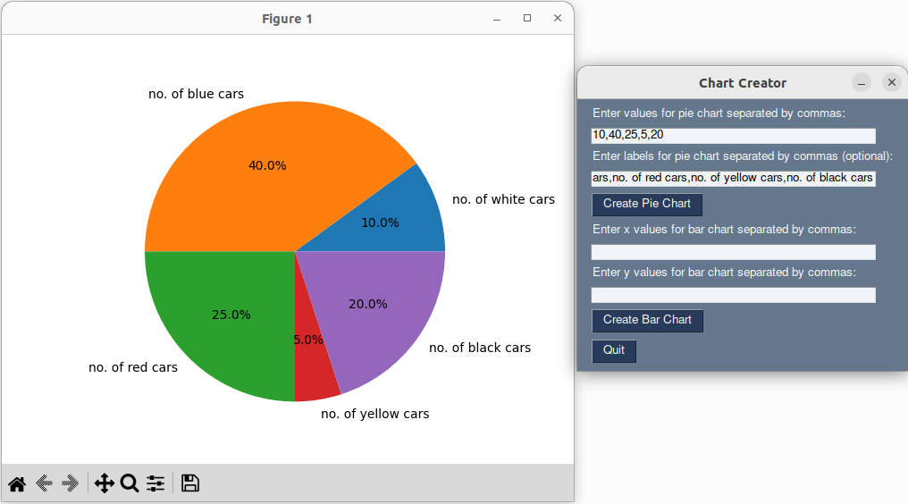
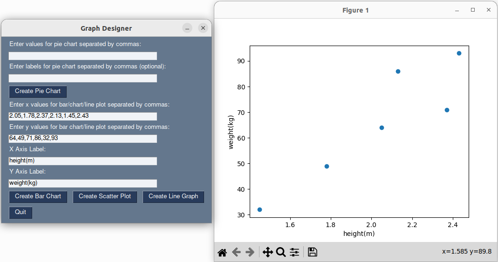

# Graph Designer

Graph Designer is a simple Python application that allows users to create pie charts, bar charts, scatter plots and line graphs using PySimpleGUI and Matplotlib.

## Features

- Create pie charts with custom values and labels.
- Create bar charts with custom x and y values.
- Create scatter plots with custom x and y values.
- Create line graphs with custom x and y values.
- Optional labels for the graphs.
- Input validation to ensure correct number of values for bar charts.

## Installation

1. Clone the repository
It is suggested to use a virtual environment.`python3 -m venv .` to make it, `source ./bin/activate` to start it.
2. Install the required Python libraries:

`pip3 install -r requirements.txt` 

3. Run the application:

```
python3 graphs.py
```

## Usage

1. Enter values for the pie chart separated by commas.
2. Enter labels for the pie chart separated by commas (optional).
3. Click on "Create Pie Chart" to generate the pie chart.
4. Enter x values for the bar chart,scatter plot or line graph separated by commas.
5. Enter y values for them separated by commas.
6. Click on the button for the desired graph to generate it.

## Screenshots





## Dependencies
- [PysimpleGui](https://docs.pysimplegui.com)
- [Matplotlib](https://matplotlib.org/)

## Future Work

- more graph types
- more user-friendly input field
- generate line of best fit
- highlight outliers

